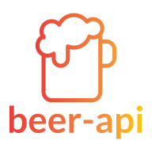

<h4 align="center">
  
</h4>

<div align="center">

[Construído con](#construído-con) | [Empecemos](#empecemos) | [Instalación](#instalación)

[:es:][readme-es] | [:us:][readme-en]

</div>
beer-api-client es un cliente que consume el REST API beer-api, desarrollada durante mi proceso de reclutamiento en La Creativería.

## Construído con

Fue desarrollada usando increíbles tecnologías:

- [React](https://es.reactjs.org/)
- [Rematch](https://rematch.github.io/rematch/#/)
- [React Hook Form](https://react-hook-form.com/)

## Empecemos

### Instalación

**Paso 1:** Clone o descargue el [repo](https://github.com/bryandms/beer-api-client).

<br />

**Paso 2:** Cambie al directorio de su repositorio.

```bash
cd /path/to/your/repo
```

<br />

**Paso 3:** Instale las dependencias.

```bash
npm install
```

<br />

**Paso 2:** Inicie su aplicación.

```bash
npm run start
```

Íconos hechos por <a href="https://www.flaticon.com/free-icon/beer_961465" title="itim2101">itim2101</a> de <a href="https://www.flaticon.com/" title="Flaticon"> www.flaticon.com</a>

[readme-es]: https://github.com/bryandms/beer-api-client/blob/master/README-ES.md
[readme-en]: https://github.com/bryandms/beer-api-client/blob/master/README.md
