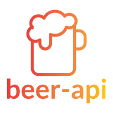

<h4 align="center">
  
</h4>

<div align="center">

[Built With](#built-with) | [Getting Started](#getting-started) | [Installation](#installation)

[:es:][readme-es] | [:us:][readme-en]

</div>
beer-api-client is a client that consumes the beer-api REST API, developed during my recruitment process at La Creativería.

## Built With

It was developed using amazing technologies:

- [React](https://reactjs.org/)
- [Rematch](https://rematch.github.io/rematch/#/)
- [React Hook Form](https://react-hook-form.com/)

## Getting Started

### Installation

**Step 1:** Clone or download the [repo](https://github.com/bryandms/beer-api-client).

<br />

**Step 2:** Switch to your repository's directory.

```bash
cd /path/to/your/repo
```

<br />

**Step 3:** Install dependencies.

```bash
npm install
```

<br />

**Step 4:** Run the app.

```bash
npm run start
```

Icons made by <a href="https://www.flaticon.com/free-icon/beer_961465" title="itim2101">itim2101</a> from <a href="https://www.flaticon.com/" title="Flaticon"> www.flaticon.com</a>

[readme-es]: https://github.com/bryandms/beer-api-client/blob/master/README-ES.md
[readme-en]: https://github.com/bryandms/beer-api-client/blob/master/README.md
